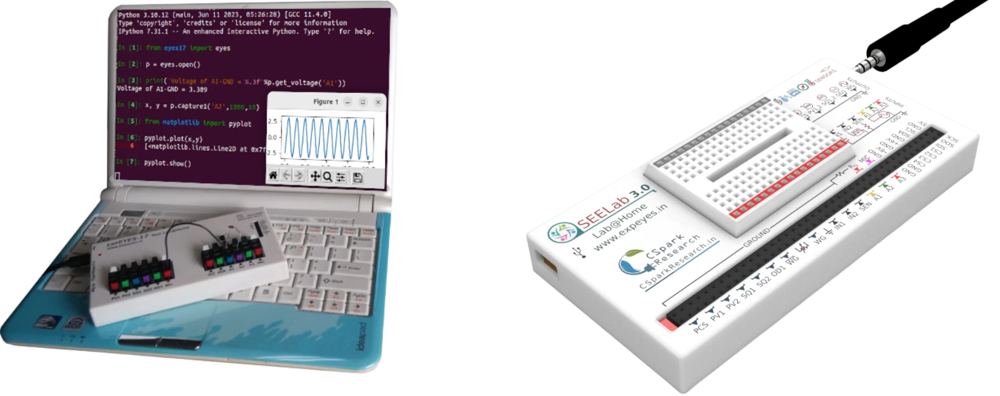
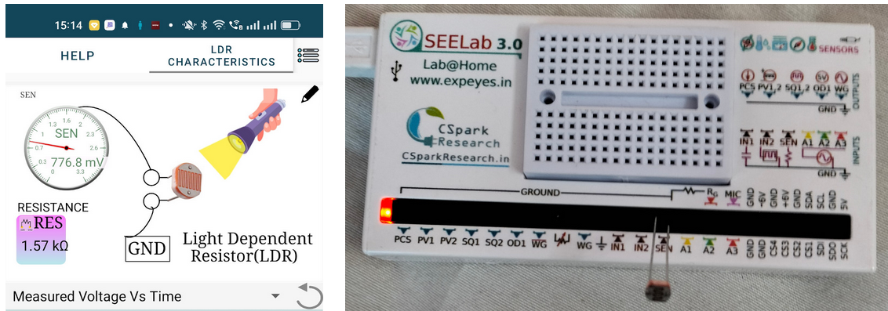

---
social:
  cards_layout_options:
    background_color: blue # Change background color
    background_image: images/cover.webp
---

# Programmer's Manual 

Welcome to the Programmer's Manual for ExpEYES-17, our innovative Test and Measurement Device, which has been specially designed with students in mind. In today's educational landscape, where hands-on learning and practical skills are crucial, this manual is your gateway to exploring the fascinating world of testing and measurement with the simplicity and power of Python.



Our goal is to make learning both enjoyable and educational. With the combined power of ExpEYES and Python, you'll be able to explore a wide range of fascinating experiments and gain practical experience that will serve you well.

??? "Pin Descriptions for the device"

	The various Input/Output terminals function as DC supplies, Voltmeter, Oscilloscope, Function Generator, Frequency Counter etc. The functions of the Terminals are briefly described below.

    + CCS : 1.1 mA Constant Current Source (0 to 1mA programmable for SEElab3)
    + PV1 : Programmable Voltage Source (DC supply). Can be set anywhere from -5V to +5V. You may consider it as a DC power supply.
    + PV2 : Similar to PV1 but -3.3V to +3.3V range.
    + SQ1 : A 0 to 5V square wave. Frequency up to 5000 Hz. SQ2 is similar but it is not available when WG is active.
    + OD1 : Digital output that can be set to 0 or 5 volts.
    + WG : Waveform Generator. Frequency of the sine wave can be set between 5 Hz and 5000 Hz. The amplitude can be set to 3V, 1V or 80mV from the software.
    + WG bar: WG output inverted. On SEELab3, it’s amplitude can be set anywhere from 0 to full scale by connecting an external resistance.
    + IN1 : Capacitance meter
    + IN2 : Frequency counter with duty cycle measurement, accepts pulses having heights between 3 to 5V.
    + SEN : Measures resistance values between 100 Ω to 100 kΩ
    + . Mainly used with sensors like photo-transistors.
    + A1 and A2 : These are Oscilloscope/Voltmeter inputs. The input range is -16V to +16V. Maximum sampling rate is 1MHz.
    + A3 : Similar to A1 and A2 but maximum range is -3.3V to +3.3V only. The input to A3 can be amplified by connecting a gain resistor Rg.
    + MIC : A condenser microphone can be connected between MIC and ground to digitize sound.
    + Dual DC Supply : A +6V and -6V outputs are provided for performing experiments using op-Amps. The current capability is around 10mA only.
    + I2C Interface: External I2C sensors can be connected to the pins 5V, GND, SCL and SDA. The software can auto-detect and use several sensors for measuring distance, pressure, temperature, acceleration etc.

Let's dive in .

## Import and connect

The following two lines import the python library, and then attempt to connect to it.
the instance `p` will now be used to access all the functions of ExpEYES. It is our gateway to the device.

!!! example "Connecting to the device"
	```python
	from eyes17 import eyes
	p = eyes.open()
	```

If connected successfully, `p` will be automatically initialized. This process also uploads the unique calibration coefficients from the connected device.

```bash
In [1]: p
Out[1]: <eyes17.eyes.Interface at 0x7fef91b95120>
```

!!! warning " Failure to detect a device "
	If connection fails, `Device opening Error` will be printed, and the `p.connected` variable
	will be set to False. After properly connecting, you can either recreate `p`, or call `p.__init__()`


[Installation Instructions :material-ray-start-arrow:](installation.md){ .md-button .full-width}

---

## Graphical Tools and the Android App

The graphical software is available for desktop & Android, making it a portable test and measurement
equipment.


Integrating essential test and measurement tools into a curriculum-based learning experience for vocational training can greatly enhance students' understanding and proficiency in their chosen field. These tools, ranging from oscilloscopes to multimeters, can be invaluable for hands-on, practical training. 

??? info "Here's a summary of how these tools have been used in vocational training:"
	  + Multimeters: Multimeters are versatile instruments used to measure voltage, current, resistance, and continuity. By incorporating multimeters into the curriculum, students can learn fundamental principles of electrical measurement and circuit testing. They can gain experience in accurately measuring and diagnosing electrical parameters.
	  + Oscilloscopes: Oscilloscopes are crucial for understanding and visualizing electrical waveforms. In a vocational curriculum, they can be used to teach students how to analyze signals, troubleshoot electronic circuits, and learn about waveform characteristics such as frequency, amplitude, and phase. Practical exercises involving oscilloscopes can help students gain real-world skills in electronics and electrical engineering.
	  + Function Generators: Function generators are indispensable for generating various waveforms, making them ideal for teaching students about signal generation and modulation. Vocational training can include hands-on experiments with function generators to explore concepts like amplitude modulation, frequency modulation, and waveform synthesis. Students can learn how to create signals for testing and prototyping purposes.
	  + Power Supplies: Power supplies are essential for providing a stable and adjustable voltage and current source for electronic circuits. Curriculum-based learning can involve using power supplies to teach students how to power and test different electronic components, troubleshoot power-related issues, and design circuits.
	  + Environmental Test Instruments: These tools, such as environmental data loggers and temperature/humidity meters, are essential for quality control and monitoring in industries like HVAC, manufacturing, and environmental science. Including them in the curriculum allows students to learn about data collection, analysis, and understanding disciplines such as thermodynamics and electrodynamics.
	  + Data Acquisition Systems: Our Android app, coupled with the device connected via USB OTG, can be used to teach students how to design and implement data acquisition and control systems. This practical experience is valuable for those pursuing careers in automation, robotics, and industrial control.

By incorporating these test and measurement tools into vocational training curricula, students can bridge the gap between theory and practical application. They gain hands-on experience that is essential for success in technical and vocational fields. Furthermore, this exposure to real-world tools and techniques prepares students for the challenges and demands of their chosen careers, equipping them with practical skills and knowledge.

The following is a list of links to the ExpEYES.in website where a systematic curriculum based learning experience has been curated. 

+ [Getting Started ](https://expeyes.in/experiments/GetStart/index.html){:target="_blank"}
+ [School Level ](https://expeyes.in/experiments/school-level/index.html){:target="_blank"}
+ [Electrical ](https://expeyes.in/experiments/electrical/index.html){:target="_blank"}
+ [Electronics ](https://expeyes.in/experiments/electronics/index.html){:target="_blank"}
+ [Mechanics ](https://expeyes.in/experiments/mechanics/index.html){:target="_blank"}
+ [Acoustics ](https://expeyes.in/experiments/sound/index.html){:target="_blank"}
+ [Thermal Physics](https://expeyes.in/experiments/thermal/index.html){:target="_blank"}
+ [Add-on Modules](https://expeyes.in/experiments/sensors/index.html){:target="_blank"}