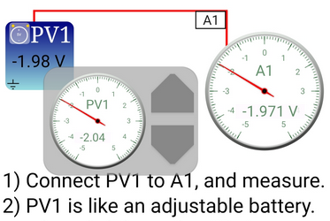

## :material-flash-triangle-outline: set_pv1 : Set Voltage on PV1 
`p.set_pv1(value)`

set output voltage on PV1 (-5 to +5 V)

| parameter | description                                                            |
|-----------|------------------------------------------------------------------------|
| value     | between -5 to 5V                                                       |
| _return_  | Actual set voltage after accounting for resolution limitations(12-bit) |

!!! tip "x = p.set_pv1(2)"
	```python
	import eyes17.eyes
	p = eyes17.eyes.open()
	p.set_pv1(2)
	#Connect PV1 to A1
	print ('Voltage at PV1 = ',p.get_voltage('A1'))
	```
	


## :material-flash-triangle-outline: set_pv2 : Set Voltage on PV2 
`p.set_pv2(value)`

set output voltage on PV2 (-3.3 to +3.3 V)

| parameter | description                                                            |
|-----------|------------------------------------------------------------------------|
| value     | between --3.3 to 3.3V                                                  |
| _return_  | Actual set voltage after accounting for resolution limitations(12-bit) |

!!! tip "x = p.set_pv2(1)"
	```python
	import eyes17.eyes
	p = eyes17.eyes.open()
	p.set_pv2(1)
	#Connect PV2 to A1
	print ('Voltage at PV2 = ',p.get_voltage('A1'))
	```


??? code " Diode Clipping Demonstration "
	```python
	import eyes17.eyes
	p = eyes17.eyes.open()
	from matplotlib import pyplot as plt
	
	p.set_sine(200)
	p.set_pv1(1.35)       # will clip at 1.35 + diode drop
	
	t,v, tt,vv = p.capture2(500, 20)   # captures A1 and A2
	
	plt.xlabel('Time(mS)')
	plt.ylabel('Voltage(V)')
	plt.plot([0,10], [0,0], 'black')
	plt.ylim([-4,4])
	
	plt.plot(t,v,linewidth = 2, color = 'blue')
	plt.plot(tt, vv, linewidth = 2, color = 'red')
	
	plt.show()


	```