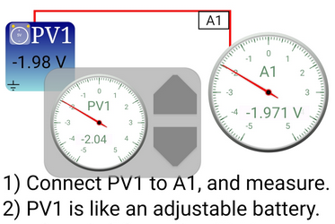

# Voltage Outputs

ExpEYES-17 / SEELab3 provides two programmable voltage sources driven by a 12-bit DAC:

| Output | Range | Notes |
|--------|-------|-------|
| **PV1** | −5 V to +5 V | Independent DAC channel |
| **PV2** | −3.3 V to +3.3 V | Independent DAC channel |

Both return the *actual* voltage set after accounting for 12-bit resolution limits.

---

## :material-flash-triangle-outline: set_pv1 : Set Voltage on PV1
`p.set_pv1(value)`

Set output voltage on PV1 (−5 to +5 V).

| parameter | description                                                            |
|-----------|------------------------------------------------------------------------|
| value     | between −5 to 5 V                                                      |
| _return_  | Actual set voltage after accounting for resolution limitations (12-bit) |

!!! tip "x = p.set_pv1(2)"
	```python
	import eyes17.eyes
	p = eyes17.eyes.open()
	actual = p.set_pv1(2)
	# Connect PV1 to A1
	print('Set voltage =', actual)
	print('Voltage at PV1 =', p.get_voltage('A1'))
	```
	


## :material-flash-triangle-outline: set_pv2 : Set Voltage on PV2
`p.set_pv2(value)`

Set output voltage on PV2 (−3.3 to +3.3 V).

| parameter | description                                                            |
|-----------|------------------------------------------------------------------------|
| value     | between −3.3 to 3.3 V                                                  |
| _return_  | Actual set voltage after accounting for resolution limitations (12-bit) |

!!! tip "x = p.set_pv2(1)"
	```python
	import eyes17.eyes
	p = eyes17.eyes.open()
	actual = p.set_pv2(1)
	# Connect PV2 to A1
	print('Set voltage =', actual)
	print('Voltage at PV2 =', p.get_voltage('A1'))
	```

---

## get_pv1 / get_pv2 : Last set voltage

Return the last voltage commanded on each DAC channel (software copy, not a fresh ADC measurement).

```python
p.set_pv1(2.5)
print(p.get_pv1())   # ≈ 2.5 (nearest 12-bit code)
print(p.get_pv2())   # last value set on PV2
```

---

??? code "Diode Clipping Demonstration"
	```python
	import eyes17.eyes
	p = eyes17.eyes.open()
	from matplotlib import pyplot as plt

	p.set_sine(200)
	p.set_pv1(1.35)       # will clip at 1.35 + diode drop

	t, v, tt, vv = p.capture2(500, 20)   # captures A1 and A2

	plt.xlabel('Time(mS)')
	plt.ylabel('Voltage(V)')
	plt.plot([0, 10], [0, 0], 'black')
	plt.ylim([-4, 4])

	plt.plot(t, v, linewidth=2, color='blue')
	plt.plot(tt, vv, linewidth=2, color='red')

	plt.show()
	```

---

## Current sources

| Source | Device | Control | Current |
|--------|--------|---------|---------|
| **CCS** | ExpEYES-17 | `p.set_state(CCS=True/False)` | Fixed ~1.1 mA (`p.currentSourceValue`) |
| **PCS** | SEELab3 | `p.set_pcs(mA)` / `p.get_pcs()` | Programmable ~0–3.3 mA (via PV2) |

### CCS — constant current (ExpEYES-17)

On **ExpEYES-17**, **CCS** is a fixed constant-current source (typically ~1.1 mA after calibration). Turn it on/off with digital state control — see [Digital I/O](digital.md#set_state-set-a-digital-pin-high-5-v--low-0-v).

```python
p.set_state(CCS=True)
print('CCS ≈', p.currentSourceValue * 1e3, 'mA')
p.set_state(CCS=False)
```

### PCS — programmable current (SEELab3)

On **SEELab3**, **PCS** is a programmable current source derived from the PV2 DAC (not available as a separate CCS switch on that product line in the same way):

\[
\mathrm{PCS\,(mA)} = 1.65 - 0.5 \times \mathrm{PV2\,(V)}
\quad\Leftrightarrow\quad
\mathrm{PV2} = 3.3 - 2 \times \mathrm{PCS}
\]

Useful range is about **0 to 3.3 mA** (compliance ~3 V). Setting PCS remaps PV2; do not use `set_pv2` for an independent voltage while PCS is in use.

#### set_pcs / get_pcs

`p.set_pcs(val)` — `val` in **mA**. Returns the actual current set (mA) after DAC quantization.

`p.get_pcs()` — returns the last commanded PCS current (mA).

```python
import eyes17.eyes
p = eyes17.eyes.open()

actual = p.set_pcs(1.0)   # aim for 1 mA (SEELab3)
print('PCS set to', actual, 'mA')
print('Last PCS =', p.get_pcs(), 'mA')
print('Underlying PV2 =', p.get_pv2(), 'V')
```
