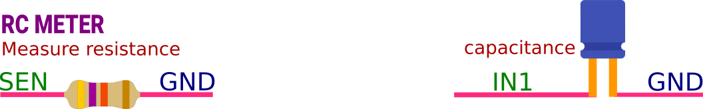

## get_resistance

Measures resistance between SEN and GND, and returns

```python
import eyes17.eyes
p = eyes17.eyes.open()
print('Resistance between SEN and GND', p.get_resistance())
```


## :material-math-norm: get_capacitance : Measure Capacitance 

Measures capacitance between IN1 and GND, and returns the value.


!!! tip ""
	```python
	import eyes17.eyes
	p = eyes17.eyes.open()
	print ('C:', p.get_capacitance())
	```


<hr>

!!! info "Additional resources"
	+ [Measuring Capacitance](https://expeyes.in/experiments/GetStart/measureCAP.html){:target="_blank"} : Measure the capacitance of different types of capacitors. Make a parallel plate capacitor using aluminium foil and measure it.
	+ [Measuring Resistance](https://expeyes.in/experiments/GetStart/measureRES.html){:target="_blank"} : Measure the resistance of a single resistor and their series and parallel combinations
