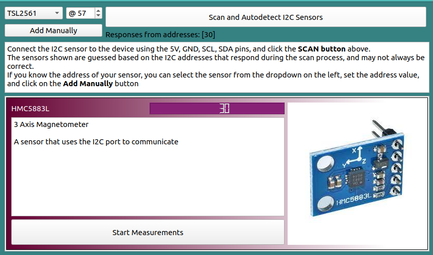
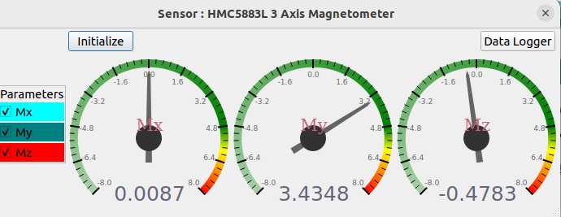
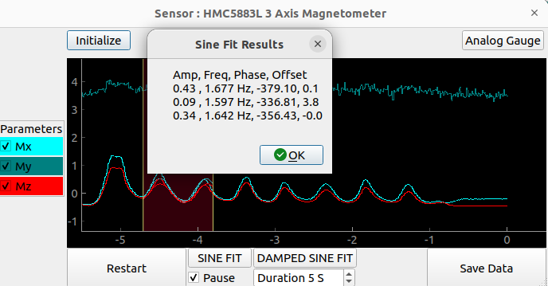
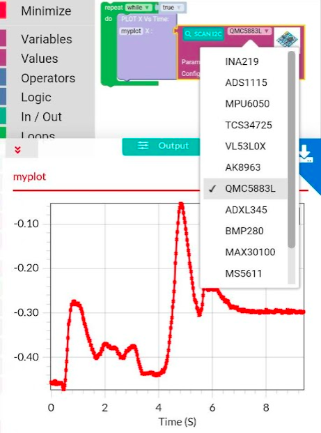

## I2C Communication interface

The I2C interface consists of 2 pins:

+ SCL, also known as the clock pin.
+ SDA, also known as the data pin.

With these two connections, and a power supply, it is possible to get data from a variety of sensors measuring
physical parameters.

### I2C function calls


=== "p.I2C.Scan()"
	```python
	scan the I2C bus, and return a list of addresses that responded
	
	  return: list of numbers between 0-127.
	```

	!!! tip "Example: HMC5883L sensor (Address:30 . 0x1E) connected"
		```python
		In [1]: p= eyes.open()	
		In [2]: p.I2C.scan()
		Out[2]: [30]
		```


=== "p.I2C.writeBulk(address,bytestream)"
	```python
	write a set of bytes to an I2C address	
	  address: Address of I2C slave device. 0-127
	  bytestream: list of bytes to write	
	```

	!!! tip "Example: HMC5883L set measurement range"
		```python
		#CONFB register = 0x01
		#set gain. 0-7 : 0 most sensitive, 7 maximum range
		In [4]: p.I2C.writeBulk(30,[0x01,1<<5])
		```

=== "p.I2C.readBulk(address, regaddr, numbytes)"
	```python
	read a set of bytes from a register in an I2C device	
	  address: Address of I2C slave device. 0-127
	  regaddr: The starting address in the I2C client from where bytes are to be read
	  numbytes: Total number of bytes to read
	  
      return: data <= List of datapoints. length = numbytes. data=False if timeout occured
	  ignore contents if data is False.
	
	```

	!!! tip "Example: HMC5883L read X,Y,Z raw data"
		```python
		#Bx register = 0x03, By=0x05, Bz=0x07
		In [6]: p.I2C.readBulk(30,0x03,6)
		Out[6]: [0, 47, 240, 0, 253, 247]
		```
		Bx = int16(vals[0]<<8|vals[1])
		By = int16(vals[2]<<8|vals[3])
		Bz = int16(vals[4]<<8|vals[5])


## Monitor I2C Sensors

!!! info "List of I2C sensors supported thus far (Minimal data logging. Configuration options available for some)"
	- MS5611 : 24 bit pressure and temperature sensor. Can resolve 15cm height variations
	- BMP280 : Pressure and temperature Sensor
	- BME280: Humidity measurement
	- TSL2561/BH1750: Light intensity sensor
	- MPU6050: 3 Axis Accelerometer, 3 axis Angular velocity (Gyro)
	- MPU9250 : 9-DOF sensor Accel/Gyro/Magnetic Fields
	- VL53L0X : Distance measurement (LIDAR)
	- MLX90614: Passive IR temperature sensor
	- AD8232 : ECG instrumentation amplifier
	- with 3 electrodes
	- AD9833: Precision Sine Wave generator
	- Dual AD9833 with 3V output
	- AD9833: Precision Sine Wave generator
	- Single output. 0.6V P2P
	- Servo Motors via SQ1, SQ2, or PCA9685
	- AHT10: Humidity Sensor
	- MAX44009; Visible Spectrum Luminosity sensor
	- QMC5883L/HMC5883L : 3 Axis Magnetometer
	- ML8511 : UV sensor
	- MAX30100: Heart rate and pulse oximetry
	- INA219 : High Side Current Sensing
	- ADS1115 : 16 bit , 4 channel voltmeter
	- TCS34725 : RGB Color sensor
	- ADXL345: 3 axis accelerometer
	- SR04 : Distance sensor (Sound based)


### I2C Sensor Oriented function calls

???+ tip "p.guess_sensor() : quickly scan and return a list of detected sensors"
	```python
	In [3]: sens = p.guess_sensor()
	DETECTED :  [30]
	____DOCS____ : HMC5883L 3 Axis Magnetometer @30
		store this sensor's module into a variable. e.g. : sens = p.guess_sensor()[0]
		sens will be None if no sensor was detected 
		Available Fields:
			Mx: from -5000 to 5000
			My: from -5000 to 5000
			Mz: from -5000 to 5000
		To read: sens.getRaw()
			 the read function returns a list of readings for sensors with multiple measurement options.

	```

	There will also be sensor specific configuration and read calls

	```python
	In [5]: sens[0].getRaw()
	Out[5]: [0.008695652173913044, 3.5217391304347827, -0.4782608695652174]
	
	In [6]: sens[0]. <press tab button to list options in iPython>
	  getVals()                MODE                     PLOTNAMES                setDataOutputRate()       
	  I2C                      name                     samplesToAverage         setGain()                 
	< init()                   NUMPLOTS                 samplesToAverage_choices setSamplesToAverage()    >
	  measurementConf          params                   scaling                  STATUS                    
	 function(rate)
	```

???+ tip "Manually initialize a sensor if you know its address"
	```python
	In [1]: from eyes17 import eyes
	
	In [2]: from eyes17.SENSORS import HMC5883L
	
	In [3]: p= eyes.open()
	
	In [4]: s = HMC5883L.connect(p.I2C,address=30)
	
	In [5]: s.getRaw()
	Out[5]: [0.008695652173913044, 3.5608695652173914, -0.4782608695652174]
	
	```

## Graphical Utility for Sensor Data logging

It is worth mentioning the easy to use logging tool for I2C sensors which includes
sensor guessing, data acquisition, visualization, as well as analytics

???+ tip "I2C Modules -> General Purpose I2C Sensors"
	

???+ tip "Data Visualization from a detected sensor"
	Click on Start Measurements for the sensor you connected
	

???+ tip "Data logging and analysis of recorded data"
	Pause the plot, select the plot region for analysis, and click on sine fit!
	


???+ tip "Logging Sensors with the Android App and Blockly Programming"
	The Android App has a dedicated data logger as well as a blockly based environment for sensor data logger.

    Click on the scan button to shortlist detected sensors , select the parameter to record, and execute the program.

	

[Project Example with TSL2561 light sensor: Malus Law](../malus.md)
A light sensor is being monitored with the flash of the camera enabled. As the camera approaches the sensor, the readings go up. Not a very clever example. TODO.
