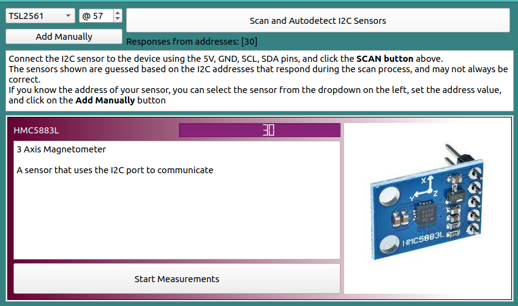
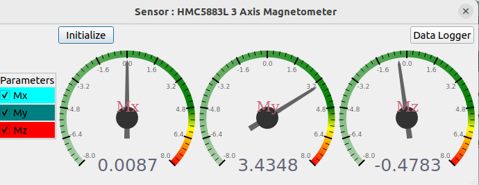
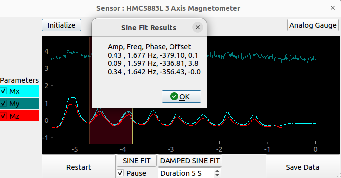
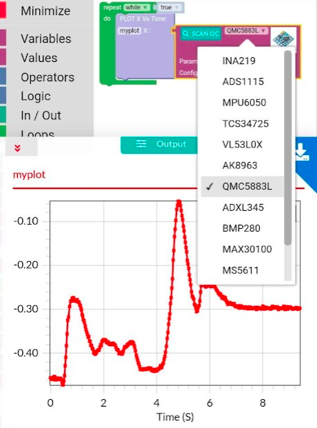

# I2C Communication and Sensors

## I2C interface

The I2C bus uses two pins:

- **SCL** — clock
- **SDA** — data

Connect SCL, SDA, power (3.3 V or 5 V as required by the sensor), and GND.

Access the bus via `p.I2C`.

### I2C function calls

=== "p.I2C.scan()"
	Scan the I2C bus and return addresses that responded (0–127).

	!!! tip "Example: HMC5883L (address 0x1E = 30)"
		```python
		from eyes17 import eyes
		p = eyes.open()
		print(p.I2C.scan())
		# e.g. [30]
		```

=== "p.I2C.writeBulk(address, bytestream)"
	Write bytes to an I2C slave.

	| parameter | description |
	|-----------|-------------|
	| address | slave address 0–127 |
	| bytestream | list of bytes |

	!!! tip "HMC5883L: set measurement range"
		```python
		# CONFB register = 0x01; gain in bits 5–7
		p.I2C.writeBulk(30, [0x01, 1 << 5])
		```

=== "p.I2C.readBulk(address, regaddr, numbytes)"
	Read bytes starting at register `regaddr`.

	| parameter | description |
	|-----------|-------------|
	| address | slave address |
	| regaddr | starting register |
	| numbytes | how many bytes to read |
	| _return_ | list of bytes, or `False` on timeout |

	!!! tip "HMC5883L: read X, Y, Z raw data"
		```python
		from numpy import int16
		vals = p.I2C.readBulk(30, 0x03, 6)
		Bx = int16(vals[0] << 8 | vals[1])
		By = int16(vals[2] << 8 | vals[3])
		Bz = int16(vals[4] << 8 | vals[5])
		print(Bx, By, Bz)
		```

=== "p.I2C.config(freq)"
	Set I2C bus frequency in Hz (default is typically ~100–400 kHz depending on firmware).

	```python
	p.I2C.config(100000)  # 100 kHz
	```

---

## Auto-detect and read sensors

`p.guess_sensor()` scans the bus and, for known addresses, returns a list of initialized sensor objects from `eyes17.SENSORS`.

Sensors with first-class `connect()` support in `guess_sensor()`:

| Address | Sensor | Docs |
|---------|--------|------|
| `0x48` | ADS1115 | [page](sensors/ads1115.md) |
| `0x23` | BH1750 | [page](sensors/bh1750.md) |
| `0x77` | BMP180 | — |
| `0x78` / `118` | BMP280 / BME280 | [page](sensors/bmp280.md) |
| `0x29` | VL53L0X | [page](sensors/vl53l0x.md) |
| `0x68` | MPU6050 | [page](sensors/mpu6050.md) |
| `0x1E` | HMC5883L | [page](sensors/hmc5883l.md) |
| `0x0D` | QMC5883L | see HMC5883L page |
| `0x5A` | MLX90614 | [page](sensors/mlx90614.md) |
| `0x39` | TSL2561 | [page](sensors/tsl2561.md) |
| `0x40` | SHT21 | — |
| `0x57` | MAX30100 (logger) | [page](sensors/max30100.md) |

SPI devices use [`p.SPI`](spi.md), not I2C.

???+ tip "p.guess_sensor()"
	```python
	from eyes17 import eyes
	p = eyes.open()
	sens = p.guess_sensor()
	# DETECTED :  [30]
	# ____DOCS____ : HMC5883L ...
	print(sens[0].getRaw())
	# or sens[0].getVals() depending on the driver
	```

???+ tip "Manually initialize a known sensor"
	```python
	from eyes17 import eyes
	from eyes17.SENSORS import HMC5883L, TSL2561, MPU6050, BMP280

	p = eyes.open()
	mag = HMC5883L.connect(p.I2C, address=0x1E)
	print(mag.getRaw())

	light = TSL2561.connect(p.I2C)
	print(light.getRaw())  # [total, IR, ...]
	```

---

## Example sensors

Detailed pages:

- [MPU6050](sensors/mpu6050.md) · [BMP280](sensors/bmp280.md) · [TSL2561](sensors/tsl2561.md)
- [HMC5883L](sensors/hmc5883l.md) · [MLX90614](sensors/mlx90614.md) · [ADS1115](sensors/ads1115.md)
- [MAX30100](sensors/max30100.md) · [BH1750](sensors/bh1750.md) · [VL53L0X](sensors/vl53l0x.md)

```python
from eyes17 import eyes
from eyes17.SENSORS import MPU6050, TSL2561

p = eyes.open()
print(MPU6050.connect(p.I2C).getRaw())
print(TSL2561.connect(p.I2C).getRaw())
```

## Non-I2C: ultrasonic SR04

Distance via SQ2/IN2 is covered under [Digital I/O](digital.md#ultrasonic-distance-hc-sr04):

```python
print(p.sr04_distance(), 'cm')
```

---

## Graphical sensor logger

The ExpEYES / SEELab desktop app includes **I2C Modules → General Purpose I2C Sensors**: auto-detect, live gauges, logging, and curve fitting.

???+ tip "I2C Modules → General Purpose I2C Sensors"
	

???+ tip "Gauges"
	

???+ tip "Logging and analysis"
	

???+ tip "Android app / Blockly"
	
