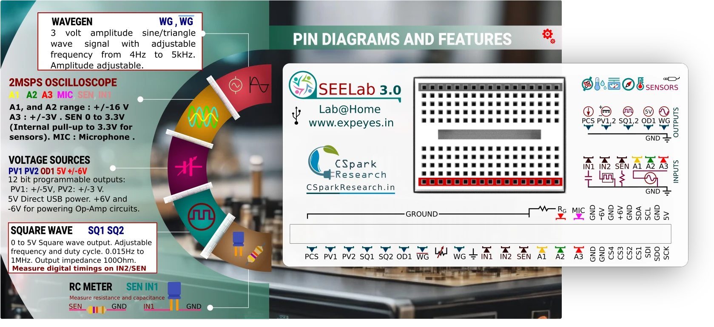

## set_sine : Set Sine Wave Frequency for WG, WGbar

set frequency of sine wave on WG. Restores waveform type to sine if some other shape had
been previously set. WGbar output will also output a sine wave which is 180 degrees out of
phase with WG at all times.

| parameter | description               |
|-----------|---------------------------|
| frequency | 4 to 5000 . Freq in Hz    |

invokes `p.set_wave(freq, 'sine')` under the hood. 

```python
p.set_wave(100) # 100 Hz sine wave on WG
```

---

## set_wave : Set Frequency and type of WG waveform out

set frequency of wave on WG. Also sets waveform type to 'sine'/'tria'.

| parameter | description            |
|-----------|------------------------|
| frequency | 4 to 5000 . Freq in Hz |
| type      | 'sine' or 'tria'       |


```python
p.set_wave(freq, 'sine')
```

---

## set_sine_amp : Set Sine Wave Amplitude

Set the amplitude of the waveform output on WG

| parameter | description              |
|-----------|--------------------------|
| value     | 2    1x amplitude (3.3V) |
|           | 1    1V                  |
|           | 0    100mV               |


```python
p.set_sine_amp(2) #3.3 V amplitude. +/-3.3V swing
```

---

## load_equation : Load a shape from a function

`p.load_equation(function, span=None, **kwargs)`

Evaluates `function` over `span` at **512** points, normalizes the result, and uploads it to WG. Then set the playback rate with `set_wave` / `set_sine`.

| parameter | description |
|-----------|-------------|
| function | `'sine'`, `'tria'`, `np.sin`, or any callable `f(x)` |
| span | `[xmin, xmax]` over which to evaluate (required for custom callables; presets pick their own) |
| amp | optional keyword (default `0.95`) — scales peak PWM duty (passed through to `load_table`) |

```python
p.load_equation('tria')          # built-in triangle
p.load_equation(np.sin, [0, 2 * np.pi])
p.set_wave(400)
```

??? tip "Fourier approximation of a square wave"
	```python
	import numpy as np
	from matplotlib import pyplot as plt
	import eyes17.eyes
	p = eyes17.eyes.open()
	# Connect WG → A1

	def f1(x):
		return np.sin(x) + np.sin(3 * x) / 3

	p.load_equation(f1, [0, 2 * np.pi])
	p.set_wave(400)

	x, y = p.capture1('A1', 500, 10)
	plt.plot(x, y)
	plt.show()
	```

---

## load_table : Load 512 raw samples to WG

`p.load_table(points, mode='arbit', **kwargs)`

Upload an arbitrary waveform table. Values are min–max normalized and scaled to the PWM lookup table.

| parameter | description |
|-----------|-------------|
| points | Sequence of **exactly 512** samples (any numeric scale; will be normalized) |
| mode | `'arbit'` (default), `'sine'`, or `'tria'` — stored as `p.WaveType` |
| amp | Peak scale 0–1 (default `0.95`) |

```python
import numpy as np
# Sawtooth
p.load_table(np.arange(512), mode='arbit')
p.set_wave(200)

# Custom table from an equation (manual)
xs = np.linspace(0, 2 * np.pi, 512, endpoint=False)
p.load_table(np.sin(xs) ** 3, amp=0.9)
p.set_wave(500)
```

After loading, use `p.set_wave(freq)` (or `set_sine`) to set how fast the table is scanned. Amplitude of the analog output is still governed by `set_sine_amp` for the WG path.

---

## set_sq1 : Set Square Wave Frequency for SQ1
`set_sqr1(self, freq, duty_cycle=50)`

set frequency of square wave on SQ1. 

| parameter  | description                 |
|------------|-----------------------------|
| frequency  | 0.02 to 100000 . Freq in Hz |
| duty_cycle | 0 to 100. default 50        |

!!! tip "Set a 1KHz square wave (0 to 5V) output on SQ1 with 10% duty cycle."
	```python
	p.set_sq1(1000,10) 
	```

---

## set_sq2 : Set Square Wave Frequency for SQ2
`set_sqr2(self, freq, duty_cycle=50)`

set frequency of square wave on SQ2. 
!!! warning
	This will disable the sine wave output on WG. invoking `set_sine` will restore the sine wave and disable this.


| parameter | description                 |
|-----------|-----------------------------|
| frequency | 0.02 to 100000 . Freq in Hz |
| duty_cycle | 0 to 100. default 50        |


```python
p.set_sq2(1000) 
```

---


???+ tip "Fourier Transformation demo"	
	### Connect WG to A1, and SQ1 to A2
	```python
	import eyes17.eyes          
	p = eyes17.eyes.open()
	
	from matplotlib import pyplot as plt
	from eyes17 import eyemath17 as em
	
	p.set_sine(1000)
	p.set_sqr1(500)
	t,v, tt,vv = p.capture2(5000, 20)   # captures A1 and A2
	
	plt.xlabel('Freq')
	plt.ylabel('Amplitude')
	plt.xlim([0,10000])

	#0.001 is to convert 20uS to mS units
	xa,ya = em.fft(v,20*0.001) 
	plt.plot(xa,ya, linewidth = 2, color = 'blue')
	
	xa,ya = em.fft(vv, 20*0.001)
	plt.plot(xa, ya, linewidth = 2, color = 'red')
	
	plt.show()
	```

