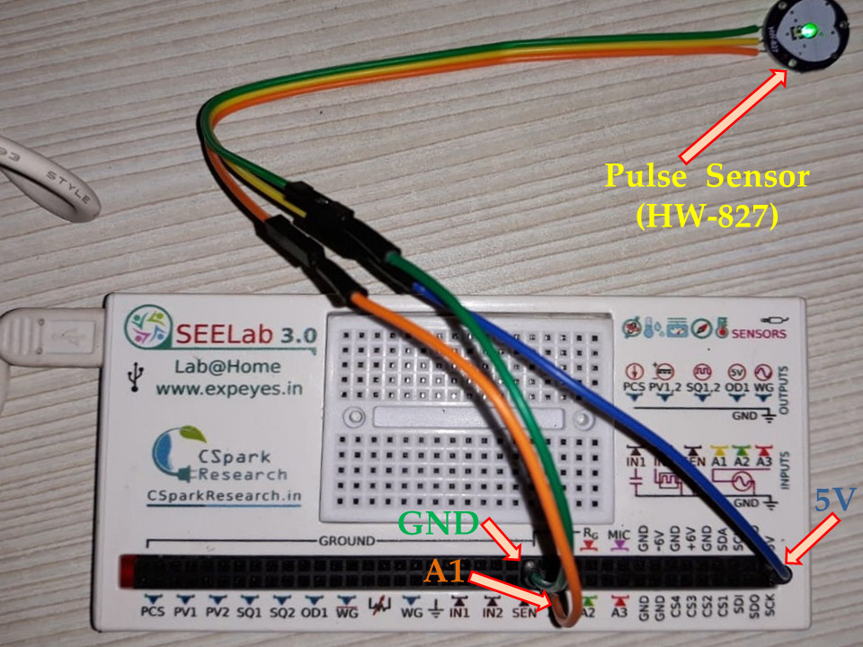
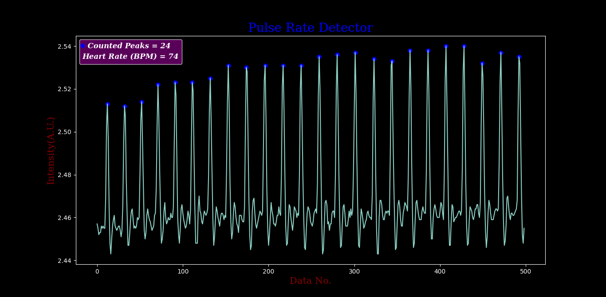

---
social:
  cards_layout_options:
    background_color: blue # Change background color
    background_image: images/thermoelectric/ET Curve.png
---

# Pulse-Rate Measurement with SEELab3

`Author  : Dr. Ujjwal Ghanta`

+ Extra equipment/sensors Needed : pulse sensor (HW-827)
+ Approx Cost: < 200 Rs

## Overview
This project aims to measure the Human Pulse Rate using pulse sensor (HW-827) and ExpEYES.

## Experimental Setup

Place your finger on the sensor, and record the analog output with the data logger app of SEELab3.

# Result:

### NOTES
> - Don't forget to delete the existing data file "HR.CSV", if you are running the file multiple times.

## License
This work is licensed under a [Creative Commons Attribution 4.0 International License](https://creativecommons.org/licenses/by/4.0/).

## Author
  - Dr. Ujjwal Ghanta

[Github Page](https://github.com/myphysicslabathome/Pulse-Rate-Calculator)
