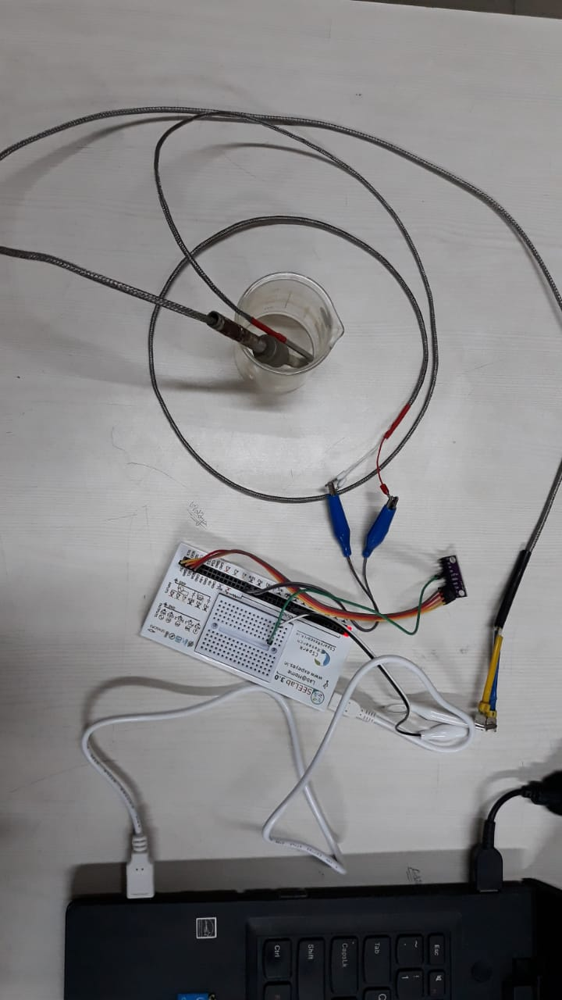
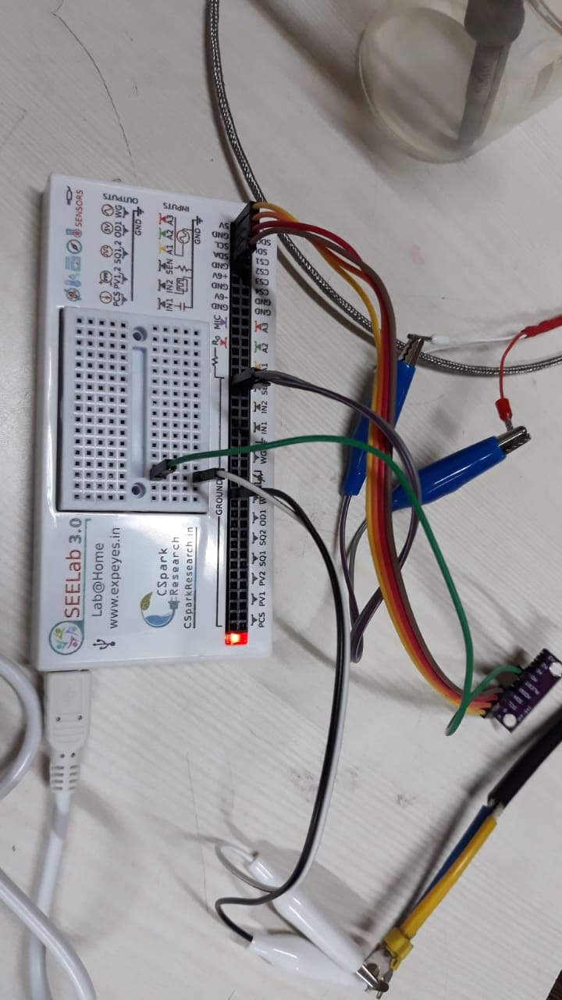
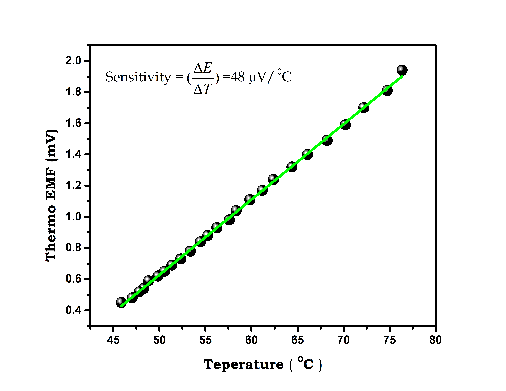

---
social:
  cards_layout_options:
    background_color: blue # Change background color
    background_image: images/thermoelectric/ET Curve.png
---

# Thermocouple Sensitivity Measurement using ExpEYES and ADS1115

`Author  : Dr. Ujjwal Ghanta`

+ Extra equipment/sensors Needed : ADS1115 16-bit ADC , PT1000
+ Approx Cost: < 400 Rs
<hr>

## Overview
This project aims to measure the sensitivity of a thermocouple by analyzing thermo-emf as a function of temperature using ExpEYES, an ADS1115 analog-to-digital converter, and a PT1000 temperature sensor.

Download the "ET_Curve.exe" file and run directly.

## Required Apparatus :

1. ExpEYES latest model (SEELAB 3.0, with I2C expansion bus)
2. Analog to digital converter (ADS1115)
3. Temperature Sensor (PT1000)
4. T/K-type thermocouple 
5. Jumper wires (with alligator clips, optional)
6. Glass beaker (100 ml)
6. Mini Immersion water heater (optional)

# Procedure:

### Experimental Setup

1. **Preparation**: Take 40 ml of hot water (~90°C).
2. **Sensor Setup**: Submerge PT1000 and T/K-type thermocouple in hot water.
3. **Connections**:
   - Connect PT1000 between SEN and Ground.
   - Connect ExpEYES (VCC, GND, SCL, SDA) to ADS1115 (VCC, GND, SCL, SDA).
   - Connect thermocouple between A0 of ADS1115 and ground. 
4. **Data Acquisition**:
   - Connect ExpEYES to PC via USB.
   - Run the provided ET_Curve.exe file.
   - Set time interval (20 or 30 sec).
   - Data (time, temperature, thermo-emf) will be saved to "ET.dat".
5. **Graphing**:
   - Plot 2nd and 3rd column
   - Fit Linear to estimate the thermocouple sensitivity (slope) and room temperature (extrapolation)


## Python Source code

??? tip "Source Code"
	```python  
    ''' Program for ET Curve with ADS1115 and
        using PT1000 and T-type thermocouple
        on 05/07/2024 
        Copyright: Dr Ujjwal Ghanta 23/Jul/24
    '''
    
    # Establish Connection
    import eyes17.eyes
    p = eyes17.eyes.open()
    
    # Import python library 
    import time, math
    import numpy as np
    from eyes17.SENSORS import ADS1115 
    
    # Define the function to mesaure the temperature
    def temperature():
        """Function to measure the instanteneous temperature"""
        R0 = 1000                    # PT1000 (RTD Name)
        Alpha = 3.85/1000            # Temperature coefficient 
        t0 = time.time()             # Time initialization
        n = 1                        # NO of measurements for averaging
        Rsum = 0
        for x in range (0,n):        # Loop for averaging
            r = p.get_resistance()   # Measure the resistance in ohm
            Rsum = Rsum+r            # Sum of resistance
        R = Rsum/n                   # Average resistance
        T = (1/Alpha)*((R/R0)-1)     # Calculate Temperature from Resistance
        return T 
    
    
    t0=time.time()                     # Time initialization
    while True:
        T = temperature()    
        ADC = ADS1115.connect(p.I2C)   # Measure the ADC
        ADC.setGain('GAIN_SIXTEEN')    # options : 'GAIN_TWOTHIRDS','GAIN_ONE','GAIN_TWO','GAIN_FOUR','GAIN_EIGHT','GAIN_SIXTEEN'
        emf = ADC.readADC_SingleEnded(0) # ADC reading in Channel A0
        ts=time.time()                   # current time
        t=ts-t0                         # Time difference
        print("%4.2f" % t, "S", "%4.2f" % T, "°C", "  ","%4.2f" % emf,"mV")
        file = open ("ET.dat", "a") # Appending file
        file.write("{0:4.2f} {1:4.2f} {2:4.2f}\n".format(t,T,emf))
        time.sleep(20)   
	```

> ### NOTES :
> - Don't forget to delete the existing data file "ET.dat", if you are running the ET_Curve.exe file multiple times.
> - Reference_data (i.e, "T-type.dat") and graph ("ET Curve.png") for T-type thermocouple are provided.

## Experimental Setup and Connections :



> ## NOTES :
> - A sample data ('T-type.dat') and the corresponding graph ('ET Curve.png') for the t-type thermocouple are also provided for reference.
> - Please see the 'Experimental Setup.jpeg' and 'Connections for ET Curve.jpeg' images for setup and connection.

# Results:

??? abstract "Raw Data"
    ```plaintext
    0.06 58.80 1.85
    20.15 76.35 1.94
    40.27 74.75 1.81
    60.41 72.20 1.70
    80.61 70.20 1.59
    100.72 68.21 1.49
    120.90 66.09 1.40
    141.07 64.39 1.32
    161.22 62.38 1.24
    181.41 61.18 1.17
    201.58 59.83 1.11
    221.72 58.33 1.04
    241.83 57.61 0.98
    261.96 56.24 0.93
    282.15 55.24 0.88
    302.35 54.46 0.84
    322.48 53.35 0.78
    342.66 52.32 0.73
    362.86 51.36 0.69
    383.06 50.55 0.65
    403.26 49.84 0.62
    423.49 48.82 0.59
    443.65 48.30 0.54
    463.80 47.83 0.52
    483.95 47.03 0.48
    504.10 45.86 0.45
    ```

## Obtained ET Curve from "T-type.dat" :


## Special thanks to:

- Heartfelt thanks to Dr. Jithin B.P. from CSpark Research for his invaluable assistance and support. His expertise and guidance were instrumental in the successful completion of this project. Dr. Jithin, your unwavering help and dedication are deeply appreciated.

- Wholehearted thanks to the entire Inter-University Accelerator Centre (IUAC), New Delhi, India team especially Er. V.V.V. Satyanarayana, Mr. Abhijit Sarkar, and Dr. Ajith Kumar B. P. for developing the device and conducting the training program.

## License
This work is licensed under a [Creative Commons Attribution 4.0 International License](https://creativecommons.org/licenses/by/4.0/).


## Author
  - Dr. Ujjwal Ghanta

[Github Page](https://github.com/myphysicslabathome/Thermo-EMF-vs.-Temperature-Curve-using-ExpEYES)
